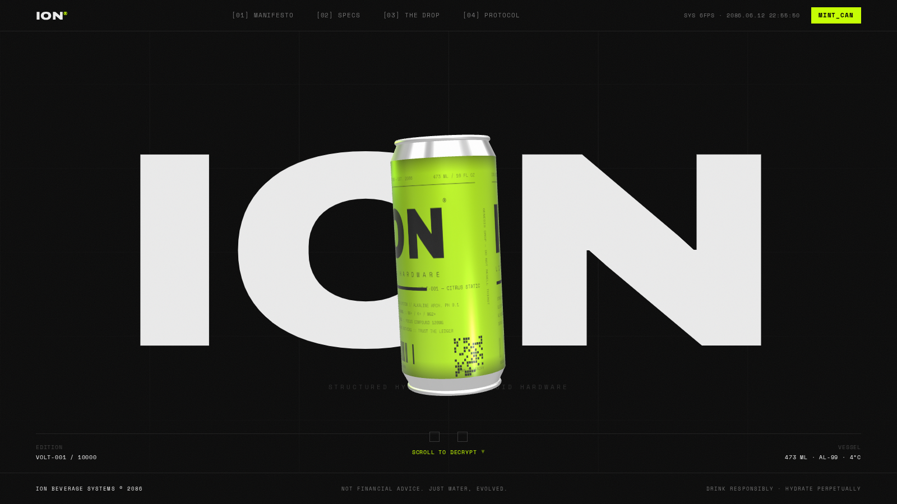
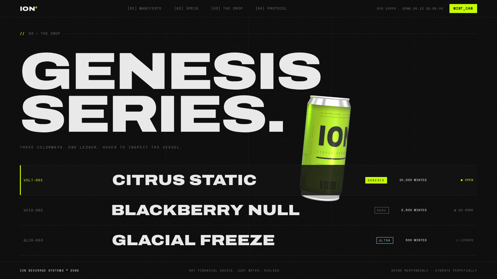
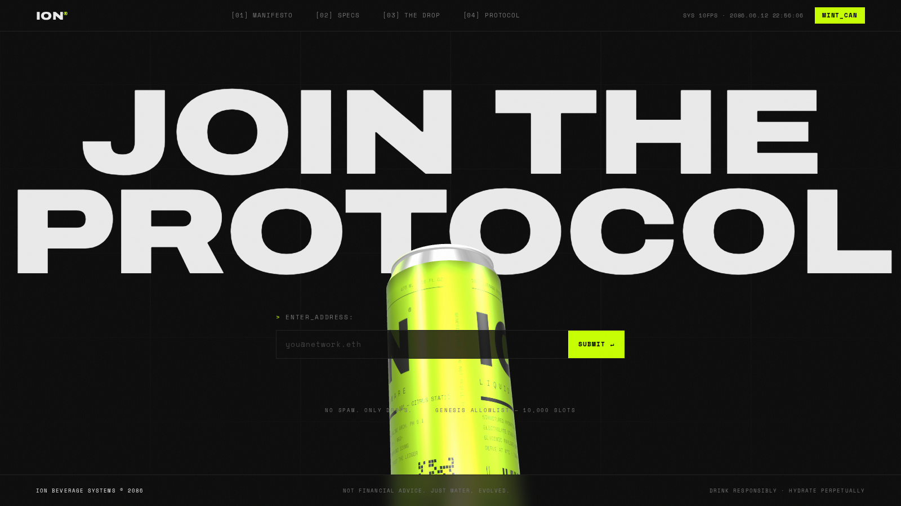

# Bogus Banana — Ridiculously Good Energy

A futuristic hydration brand where the product **is** the experience. The landing
page is built around one persistent, interactive 3D can instead of product
photography — every section is staged as a product reveal, styled like the
launch page of a consumer technology company.



## Concept

**ION** is structured hydration presented through crypto-native design language:

- **Boot sequence** — the site cold-boots like an operating system (`ION_OS v4.2.0`)
- **Genesis drop** — 10,000 serialized cans across three colorways (VOLT / VOID / GLACIER)
- **Hydronomics** — the formula presented as token distribution bars
- **Roadmap** — phases instead of features, `MINT_CAN` instead of "buy now"
- **OS chrome** — hairline grid overlays, mono telemetry, live FPS + protocol clock, film grain

**Design:** minimalist, Apple-inspired — white space, Inter (SF-style) type, a
single restrained blue accent (`#0071e3`) on white, and the 3D can as the hero.
(Earlier revisions used a dark "futuristic-OS" theme; the current look is light.)

## The 3D can

The can is **fully procedural** — no model files, no image assets:

- Geometry: a primitive stack (cylinders, tori, lathe-style tapers, pull tab)
- Labels: drawn at runtime onto `CanvasTexture`s (wordmark, specs, barcode,
  QR data block, serial) — one per colorway, repainted when webfonts arrive
- Lighting: PMREM-filtered `RoomEnvironment` IBL + volt rim light

### Interaction model

| Input | Reaction |
| --- | --- |
| Scroll | The can travels between per-section poses (position / tilt / scale / spin rate), eased in the render loop |
| Pointer move | Parallax tilt on the rig + camera |
| Drag (empty space) | Spin momentum with friction |
| Click the can | Squash-and-stretch pulse + emissive flash |
| Hover / scroll edition rows | Live colorway + label swap (VOLT-001, VOID-002, GLCR-003) |

Honors `prefers-reduced-motion`, clamps DPR at 2, pauses rendering in hidden
tabs, and degrades to a flat layout when WebGL is unavailable.

| The drop — live colorway swap | Join — final reveal |
| --- | --- |
|  |  |

## Stack

- [Vite](https://vitejs.dev) — dev server / build
- [three.js](https://threejs.org) — the vessel
- Self-hosted Inter (variable) via Fontsource — closest free match to Apple's SF
- Zero animation libraries — reveals are IntersectionObserver + CSS, choreography is rAF

## Run

```bash
npm install
npm run dev      # http://localhost:5173
npm run build    # static build in dist/
npm run preview
```

## Deploy

Containerized for **Google Cloud Run** (`Dockerfile` + `deploy.sh`):

```bash
GCP_PROJECT=your-project-id ./deploy.sh   # Cloud Build → public Cloud Run URL
```

See [`docs/DEPLOY.md`](docs/DEPLOY.md) for prerequisites and the managed
Google-Cloud-integration path.

## Market Intel dashboard

A second page — [`dashboard.html`](dashboard.html), linked from the nav as
**MARKET INTEL** — turns the cleaned research in [`data/`](data/) into an
`ION_OS` analytics terminal across 14 panels: **market size** ($98B → $107B
forecast, Statista), **concept interest** (Mintel — what consumers want to try),
**why-they-drink motivations** (Mintel), share of voice, **brand momentum** (trailing-12-mo trend lines), a
**rising/cooling leaderboard**, category momentum, an Amazon price × quality map,
a **flavor demand board**, review ratings, Instagram engagement, a **Reddit
community pulse**, a **loves-vs-complaints sentiment** breakdown mined across
**125K+ comments**, and a sortable 23-brand cross-platform matrix. Same
near-black + volt aesthetic, hand-rolled SVG charts, no charting library.

**Trend-spotting & credibility (Momentum pass).** The dashboard answers *who's
moving*, not just *who's big*: per-brand monthly **mention-share** is normalized
for the growing corpus, smoothed over trailing-12-month windows, and the partial
final scrape month is excluded so trends don't show a false cliff. Share of voice
uses **fractional attribution** (a video's views split across the brands it names)
and strips music/entertainment false-matches — ~1.2B phantom views (e.g. Eminem's
*"The Monster"*, which had inflated Monster Energy ~10×) are removed, so Red Bull
and Monster correctly land neck-and-neck.

The numbers come from a precomputed aggregate, `public/data/dashboard.json`
(~20 KB) — served as a standalone file (not bundled) so nginx can guard it with
Basic Auth — built from the cleaned CSVs by:

```bash
pip install vaderSentiment            # optional — enables real sentiment (else a lexicon fallback)
python data/scripts/build_dashboard_json.py   # reduces 129K+ records → one small JSON
```

The **external sources** (market size, Mintel survey, Reddit) are cleaned by a
separate step into `data/market/` and `data/reddit/` (the raw corpus — Mintel /
Catalyst `.xlsx`, Reddit dumps — is **not** committed, per repo convention):

```bash
pip install openpyxl vaderSentiment
RAW_DATA_DIR=/path/to/unzipped/02_Data python data/scripts/build_external_datasets.py
python data/scripts/build_dashboard_json.py   # folds them into the aggregate
```

Nothing large is shipped to the browser — the 25 MB comment corpus is reduced
to theme/momentum/flavor/sentiment aggregates at build time. Sentiment uses VADER
when installed (the loves-vs-complaints split), else a built-in lexicon. Regenerate
the JSON after the data changes.

### Dashboard login

The dashboard is reachable via the **MARKET INTEL ↗** link in the landing-page top
bar (visible at every screen width) or directly at `/dashboard.html`, and opens
behind a styled login — username `energydrinks`, password `energydrinks12345`.

**This is enforced server-side, not just cosmetically.** The dashboard's data
(`/data/dashboard.json`) is served behind **nginx HTTP Basic Auth** (`.htpasswd`),
and the login form fetches it with the entered credentials. So the licensed
Mintel/Statista figures are never sent without valid credentials — bypassing the
JS check in devtools just yields an empty shell. (Locally via `npm run dev` there's
no nginx, so the client-side check alone gates it; the real enforcement is on the
deployed nginx / Cloud Run.)

To change the credentials, update **both**:

```bash
# 1) server (Basic Auth) — the real gate:
htpasswd -bc .htpasswd energydrinks 'NEWPASS'     # or: openssl passwd -apr1
# 2) client check (instant UX / local dev) — PASS_HASH in src/auth.js:
printf '%s' 'NEWPASS' | sha256sum
```

### Waitlist capture

The landing-page "JOIN THE PROTOCOL" form persists signups (deduped, with UTM +
referrer) to `localStorage`. To forward them to a real backend/ESP, set a build-time
env var — the form then POSTs each record as JSON and still stores it locally as a
fallback:

```bash
VITE_WAITLIST_ENDPOINT=https://your-endpoint.example/subscribe npm run build
```

## Structure

```
index.html                 landing skeleton — hero, ticker, manifesto, specs, drop, protocol, join
dashboard.html             market-intel terminal (charts + brand matrix)
src/main.js                entry: fonts, boot sequence, wiring
src/style.css              futuristic-OS design system (shared by both pages)
src/can.js                 procedural can + canvas label textures (3 colorways)
src/scene.js               renderer, scroll choreography, pointer physics
src/fx.js                  split-text reveals, counters, ticker, cursor, edition sync
src/dashboard.js           dashboard: panels, sortable table, count-up, scroll reveals
src/dashboard.css          dashboard layout + chart styling (imports style.css)
src/charts.js              dependency-free SVG chart builders (bars, scatter, area)
src/data/dashboard.json    precomputed aggregate consumed by the dashboard
data/scripts/build_dashboard_json.py   regenerates the aggregate from data/*.csv
```

## Project status

- **Deploy:** containerized for **Google Cloud Run** — `./deploy.sh` →
  service `ion-liquid-hardware`. See [`docs/DEPLOY.md`](docs/DEPLOY.md)
  (deploy from Google Cloud Shell; this repo is private so authenticate first).
- **In progress:** a data-driven recommendation for a **new energy-drink
  concept** to anchor the site, built from the market research in `data/`
  (Amazon · Instagram · YouTube · Reddit · Mintel · Catalyst).

**Working on this with an AI agent?** Current state, the active task, and exact
next steps live in **[`CLAUDE.md`](CLAUDE.md)** → "Status & handoff". Note: the
raw research corpus is **not committed** (size + PII), so re-upload it in a new
session to analyze the new sources.

---

*ION BEVERAGE SYSTEMS © 2086 — not financial advice. Just water, evolved.*
